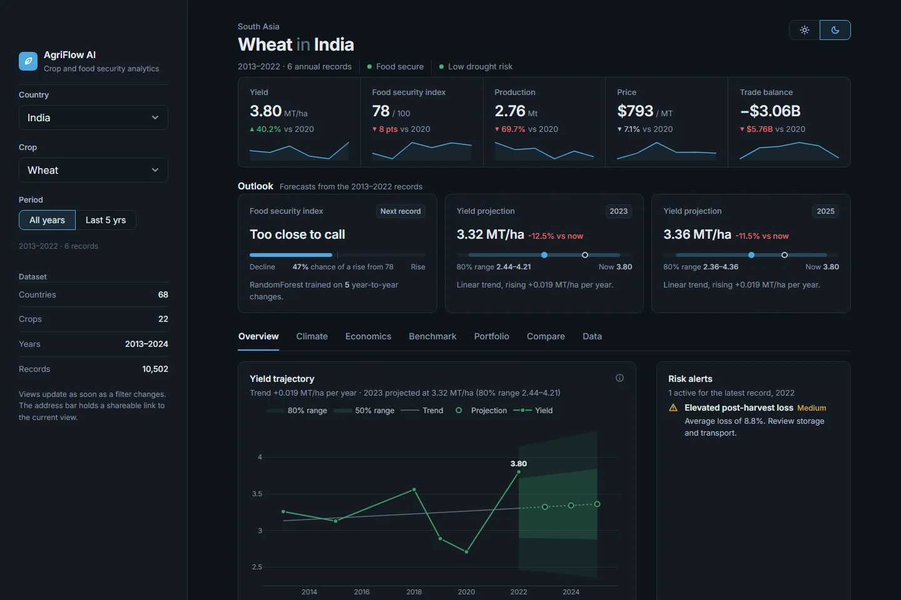

# AgriFlow AI

Crop and food security analytics for 68 countries and 22 crops, 2013–2024. Choose a country and a crop to see
yield trends and projections, a machine-learning food security outlook, climate and trade analysis, and how the
country compares with every other producer.

[](https://www.python.org/)
[](https://streamlit.io/)
[](#license)

**[Live dashboard](https://agriflowai.streamlit.app/)** · [Quick start](#quick-start) · [How it works](#how-it-works)



## Features

- **Outlook**: the probability that the food security index (FSI) rises by the next record, plus yield
  projections one and three years out with a likely range.
- **Seven views** of the selected country and crop, listed below.
- **Instant updates**: changing a filter re-renders the page, and only the open tab is computed.
- **Light and dark themes**, switchable from the header.
- **Shareable links**: the URL keeps the country, crop, period, theme and tab, for example
  `?country=India&crop=Wheat&tab=Benchmark`.

| View | What it shows |
|---|---|
| Overview | Yield trajectory with 50% and 80% projection ranges, FSI by status band, the latest year against its own history, farm operations against other countries, risk alerts |
| Climate | Rainfall anomalies, temperature, rainfall vs yield, correlation matrix of the main drivers |
| Economics | Indexed trends, production change split into yield and area effects, area-and-yield path over equal-production curves, price, profit margin, trade balance, harvest-loss Sankey |
| Benchmark | World map, country ranking, percentile bands against all producers, yield vs food security, yield vs stability, percentile profile |
| Portfolio | Crop-by-year yield heatmap, yield momentum by crop, production treemap |
| Compare | Two crops of the same country side by side, with a percentile comparison |
| Data | The filtered records, downloadable as CSV |

## Quick start

Requires Python 3.10 or newer (tested on 3.14).

```bash
git clone https://github.com/Deepak17kb/AgriFlow.git
cd AgriFlow
pip install -r requirements.txt
streamlit run app.py
```

The dashboard opens at `http://localhost:8501`.

## How it works

**Data.** `utils.load_data()` reads `data.csv` and maps common column-name variants (for example `yield_mt_ha`,
`yield` or `value`) to standard names, so a CSV with slightly different headers still loads.

**Food security outlook.** For each country and crop, a `RandomForestClassifier` (100 trees) is trained on the
records in the selected period.

- Target: whether FSI rises by the next record.
- Features: yield, production, rainfall and temperature.
- The latest record has no known outcome, so it is held out of training and is the record being predicted.
- If the history contains only one outcome (FSI always rose, or never did), a classifier cannot be trained and
  the app uses the smoothed share of past rises instead.

Each country and crop has only 2–11 year-to-year changes, so treat the probability as a rough signal rather than a
calibrated forecast.

**Yield projections.** A least-squares linear trend over the selected period, projected one and three years past
the latest record, with 50% and 80% prediction ranges from a t-distribution (so they widen when there are few
records).

**Production decomposition.** In `data.csv`, production is in thousand tonnes and equals yield × harvested area
÷ 1,000. The change between the first and latest record therefore splits exactly into a yield effect, an area
effect and their interaction.

**Coverage rules.** Only crops with at least 3 records are listed for a country, and the 5- and 3-year periods
appear only when they still contain 3 records, so every selection can be analysed.

**Risk alerts** are rule-based:

| Alert | High | Medium |
|---|---|---|
| Drought risk | Latest record is High or Critical | Latest record is Moderate |
| Food security falling | FSI down more than 5 points over the last records | Any fall |
| Post-harvest loss | Period average above 15% | Period average above 8% |
| Outlook | — | Chance of an FSI rise at or below 35% |

A chance of an FSI rise at or above 65% is shown as a positive note.

## Dataset

`data.csv` holds 10,502 annual records with 56 columns.

| | |
|---|---|
| Years | 2013–2024 |
| Countries | 68, across 10 regions |
| Crops | Barley, Cassava, Cocoa, Coffee, Cotton, Fruits, Groundnut, Maize, Millet, Oilseeds, Potato, Pulses, Rapeseed, Rice, Sorghum, Soybean, Sugarcane, Sunflower, Sweet Potato, Tea, Vegetables, Wheat |
| Main fields | Yield (t/ha), harvested area (ha), production (thousand tonnes), food security index and status, drought risk, rainfall, temperature, price, exports, imports, profit margin, post-harvest loss, food waste, irrigation, mechanization, soil health |

## Project structure

```
app.py                  Streamlit entry point: layout, state, alerts
charts.py               Plotly figure builders
ui.py                   Light and dark theme tokens, CSS, HTML helpers
model.py                Forecast target, RandomForest training and prediction
utils.py                CSV loading, column-name mapping, ISO-3 country codes
data.csv                Dataset
.streamlit/config.toml  Base Streamlit theme and toolbar settings
site/                   Static project page served by Vercel
vercel.json             Vercel configuration (serves site/ only)
requirements.txt        Python dependencies
```

## Configuration

- **Model features**: edit `FEATURES` at the top of `model.py`, for example to add `SoilHealth` or `Irrigation`.
- **Column names**: add aliases to the matching block in `utils.load_data()`.
- **Colors**: both themes live in `THEMES` in `ui.py`. Interface tokens become CSS variables and the `c_*` keys
  color the charts. Chart colors that share a plot were checked for color-vision deficiency, so re-check any you
  change.

## Deployment

| Platform | Serves |
|---|---|
| Streamlit Community Cloud | The dashboard (`app.py`). Streamlit needs a long-running Python server with a WebSocket connection. |
| Vercel | The static project page in `site/`. `vercel.json` and `.vercelignore` keep the Python app out of the Vercel build. |

To deploy the dashboard: on [share.streamlit.io](https://share.streamlit.io), choose **Create app → Deploy a public
app from GitHub**, then select `Deepak17kb/AgriFlow`, branch `main` and file `app.py`. Pushes to `main` redeploy it.

## License

MIT
