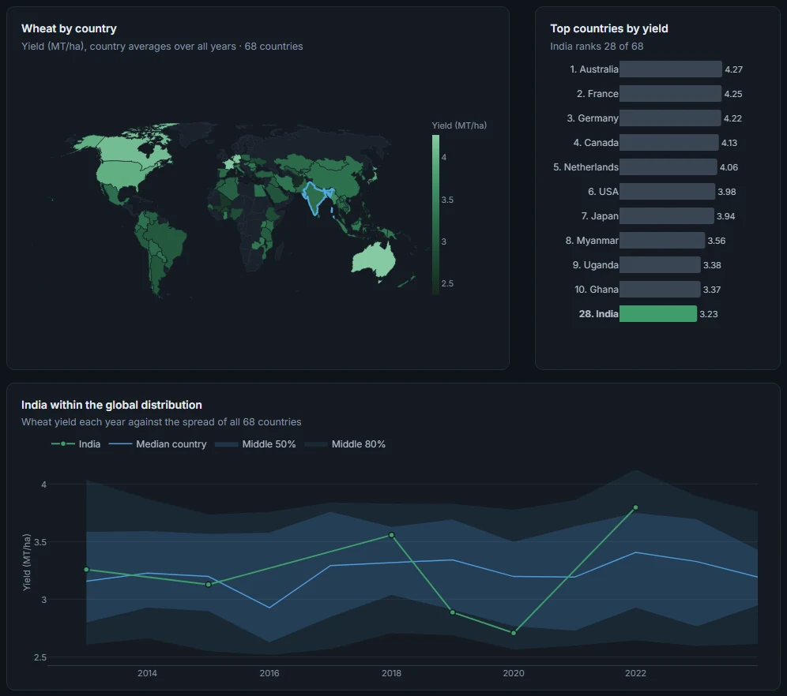
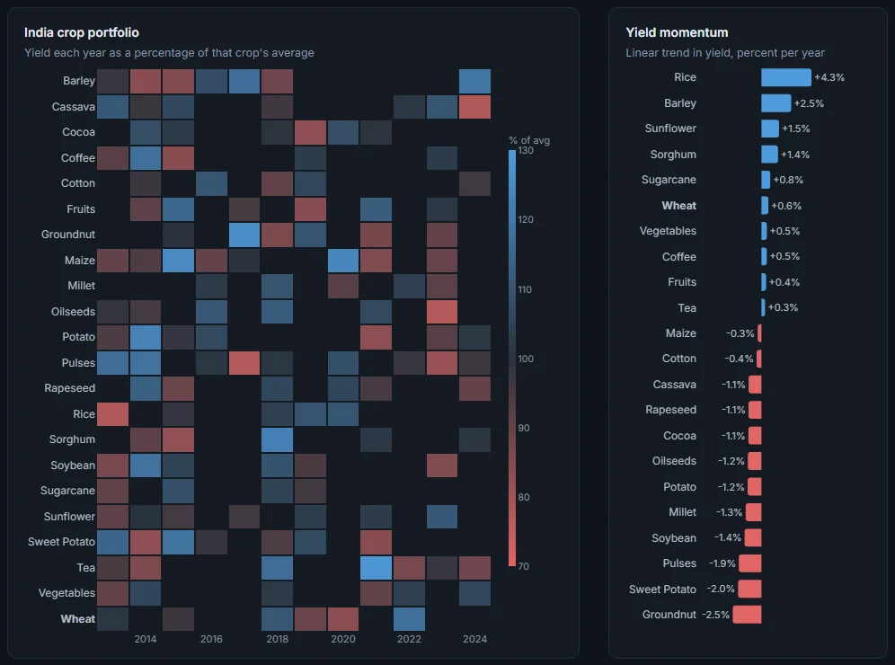
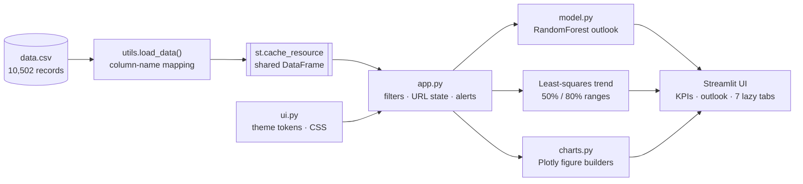
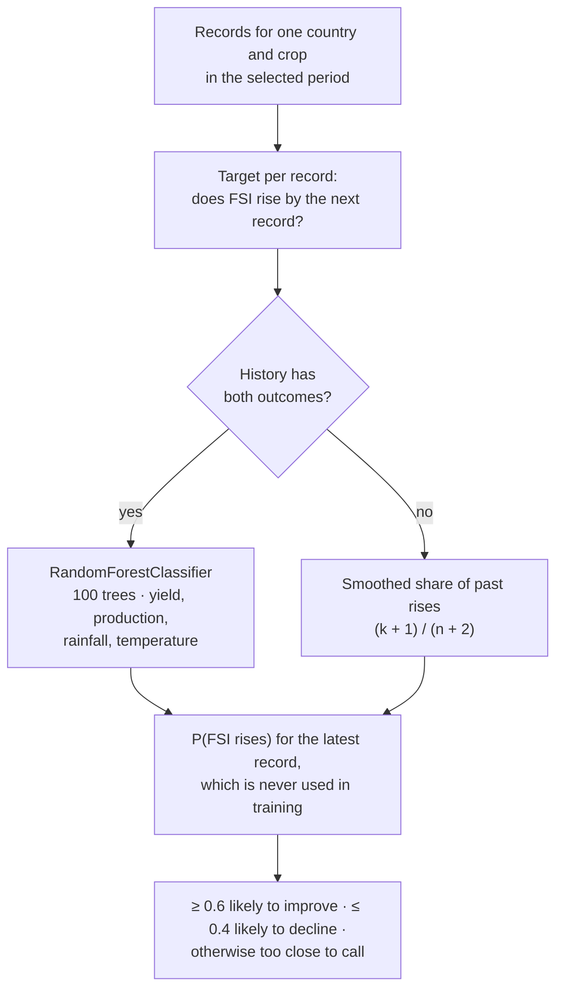
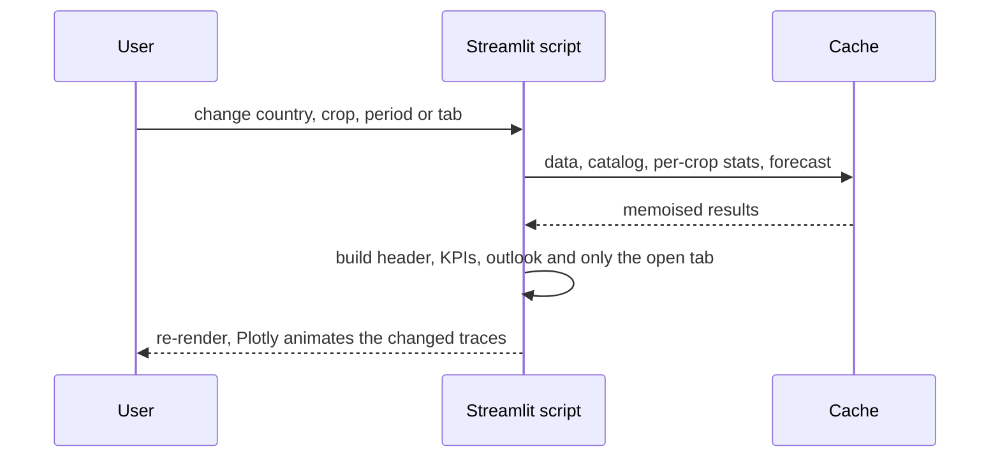

<div align="center">

# AgriFlow AI

**Crop and food security analytics for 68 countries and 22 crops, 2013–2024**

Yield trends and projections · machine-learning food security outlook · climate, production and trade analysis ·
global benchmarking

[](https://www.python.org/)
[](https://streamlit.io/)
[](https://plotly.com/python/)
[](https://scikit-learn.org/)
[](https://pandas.pydata.org/)
[](#license)

[**Live dashboard**](https://agriflowai.streamlit.app/) · [Quick start](#quick-start) · [Architecture](#architecture) · [Methods](#analytics-and-methods)

</div>


## Highlights

| | |
|---|---|
| **Forecasting** | RandomForest probability that the food security index (FSI) rises by the next record; yield projections with 50% and 80% prediction ranges |
| **Seven analysis views** | Overview, Climate, Economics, Benchmark, Portfolio, Compare and Data, each built only when its tab is open |
| **Decomposition** | Production change split exactly into yield, harvested-area and interaction effects |
| **Benchmarking** | World map, rankings, percentile bands against every producer, yield vs stability, percentile profile |
| **Reactive state** | Every filter re-renders instantly; country, crop, period, theme and tab live in the URL, so any view is a shareable link |
| **Design system** | Light and dark themes from one token set; chart colours validated for colour-vision deficiency |

## Selected views

<table>
<tr>
<td width="50%" valign="top"></td>
<td width="50%" valign="top"></td>
</tr>
<tr>
<td><b>Benchmark</b> · choropleth, ranking, and the country's yield inside the global percentile bands</td>
<td><b>Portfolio</b> · yield of every crop by year as % of its own average, with trend per crop</td>
</tr>
</table>

## Architecture



| Module | Responsibility |
|---|---|
| `app.py` | Page layout, sidebar filters, session and URL state, KPI tiles, outlook, alert rules, tab routing |
| `charts.py` | One function per chart; each takes the active theme and returns a styled Plotly figure |
| `ui.py` | Light and dark token sets, global CSS (including Streamlit widgets), small HTML helpers |
| `model.py` | Forecast target, RandomForest training with a single-class fallback, prediction |
| `utils.py` | CSV loading, mapping of column-name variants to standard fields, ISO-3 country codes |

## Analytics and methods

### Food security outlook



Each country and crop has only 2–11 year-to-year changes, so the probability is a rough signal, not a calibrated
forecast.

### Yield projections

A least-squares line $\hat{y} = a + bx$ is fitted to yield over the selected years and projected one and three years past
the latest record. The shaded ranges are prediction intervals from a t-distribution with $n-2$ degrees of freedom:

```math
\hat{y}_0 \;\pm\; t_{q,\,n-2}\; s\,\sqrt{1 + \frac{1}{n} + \frac{(x_0-\bar{x})^2}{\sum_i (x_i-\bar{x})^2}},
\qquad q = 0.75 \;(50\%),\quad q = 0.90 \;(80\%)
```

With few records the t-quantile is large, so the ranges widen honestly.

### Production decomposition

In `data.csv`, production (thousand tonnes) equals yield $Y$ (t/ha) × harvested area $A$ (ha) ÷ 1,000, so the change
between the first and latest record splits exactly into three parts:

```math
\Delta P \;=\; \frac{1}{1000}\Big(\underbrace{\Delta Y \cdot A_0}_{\text{yield effect}}
\;+\; \underbrace{\Delta A \cdot Y_0}_{\text{area effect}}
\;+\; \underbrace{\Delta Y \cdot \Delta A}_{\text{interaction}}\Big)
```

### Benchmarks and comparisons

| Measure | Definition |
|---|---|
| Percentile rank | Share of countries below the value, plus half of ties; loss rate is inverted so higher is always better |
| Latest year vs history | $z = (x_{\text{latest}} - \bar{x}) / s$ over the selected period |
| Yield volatility | Coefficient of variation of yearly yield, $s / \bar{x}$ |
| Percentile bands | 10th, 25th, 50th, 75th and 90th percentile of yield across countries, per year |

<details>
<summary><b>Risk alert rules</b></summary>

| Alert | High | Medium |
|---|---|---|
| Drought risk | Latest record is High or Critical | Latest record is Moderate |
| Food security falling | FSI down more than 5 points over the last records | Any fall |
| Post-harvest loss | Period average above 15% | Period average above 8% |
| Outlook | — | Chance of an FSI rise at or below 35% |

A chance of an FSI rise at or above 65% is shown as a positive note.

</details>

## Engineering notes



- **Caching**: the dataset is loaded once per process (`st.cache_resource`); catalog, per-crop statistics and
  forecasts are memoised with `st.cache_data`.
- **Lazy tabs**: `st.tabs(..., on_change="rerun")` exposes which tab is open, so only that tab's charts are built.
- **URL state**: the first load restores the view from query parameters; every rerun writes them back.
- **Theming**: Streamlit's own theme stays light; both modes are CSS variables emitted from `THEMES` in `ui.py`, so
  switching only swaps the token block and the page fades between modes.
- **Chart colours**: pairs that share a plot (crop A/B, above/below zero) pass colour-vision-deficiency checks in both
  modes; status colours always come with a text label.
- **Coverage rules**: only crops with at least 3 records are offered, and the 5- and 3-year periods appear only when
  they still hold 3 records, so every selection can be analysed.

## Tech stack

| Layer | Technology | Tested version |
|---|---|---|
| App framework | Streamlit | 1.56 |
| Charts | Plotly | 6.7 |
| Model | scikit-learn (RandomForestClassifier) | 1.8 |
| Statistics | SciPy (t-distribution), NumPy | 1.17, 2.4 |
| Data | pandas | 3.0 |
| Runtime | Python | 3.14 (3.10+ supported) |

## Quick start

```bash
git clone https://github.com/Deepak17kb/AgriFlow.git
cd AgriFlow
python -m venv .venv && source .venv/bin/activate   # Windows: .venv\Scripts\activate
pip install -r requirements.txt
streamlit run app.py
```

The dashboard opens at `http://localhost:8501`. Any view can be opened directly, for example
`http://localhost:8501/?country=Kenya&crop=Maize&theme=dark&tab=Benchmark`.

<details>
<summary><b>Configuration</b></summary>

- **Model features**: edit `FEATURES` in `model.py`, for example to add `SoilHealth` or `Irrigation`.
- **Column names**: add aliases to the matching block in `utils.load_data()`.
- **Colours**: both themes live in `THEMES` in `ui.py`; interface tokens become CSS variables and the `c_*` keys colour
  the charts. Re-check colour-vision separation for any chart colours you change.

</details>

## Dataset

| Property | Value |
|---|---|
| Records | 10,502 annual records, 56 columns |
| Coverage | 68 countries in 10 regions, 2013–2024 |
| Crops | 22 (listed below) |
| Key fields | Yield (t/ha), harvested area (ha), production (thousand t), FSI and status, drought risk, rainfall, temperature, price, exports, imports, profit margin, post-harvest loss, food waste, irrigation, mechanization, soil health |

<details>
<summary><b>Crops</b></summary>

Barley, Cassava, Cocoa, Coffee, Cotton, Fruits, Groundnut, Maize, Millet, Oilseeds, Potato, Pulses, Rapeseed, Rice,
Sorghum, Soybean, Sugarcane, Sunflower, Sweet Potato, Tea, Vegetables, Wheat

</details>

## Project structure

```
AgriFlow/
├── app.py                  Streamlit entry point: layout, state, alerts
├── charts.py               Plotly figure builders
├── ui.py                   Theme tokens, CSS, HTML helpers
├── model.py                Forecast target, training, prediction
├── utils.py                Data loading and column mapping
├── data.csv                Dataset
├── requirements.txt        Python dependencies
├── .streamlit/config.toml  Base Streamlit theme and toolbar
├── docs/                   README images
├── site/                   Static project page (Vercel)
└── vercel.json             Vercel configuration: serve site/ only
```

## Deployment

| Platform | Serves | Notes |
|---|---|---|
| Streamlit Community Cloud | The dashboard (`app.py`) | Needs a long-running Python server with WebSockets. Deploy from [share.streamlit.io](https://share.streamlit.io): repo `Deepak17kb/AgriFlow`, branch `main`, file `app.py` |
| Vercel | The static project page in `site/` | `vercel.json` and `.vercelignore` keep the Python app out of the Vercel build |

## Limitations

- Forecasts are trained per country and crop on at most 11 year-to-year changes, so probabilities are indicative only.
- The yield projection is a straight-line trend; it does not model weather, prices or policy.
- Benchmarks use each country's average over all years, not the period chosen in the sidebar.

## License

MIT
